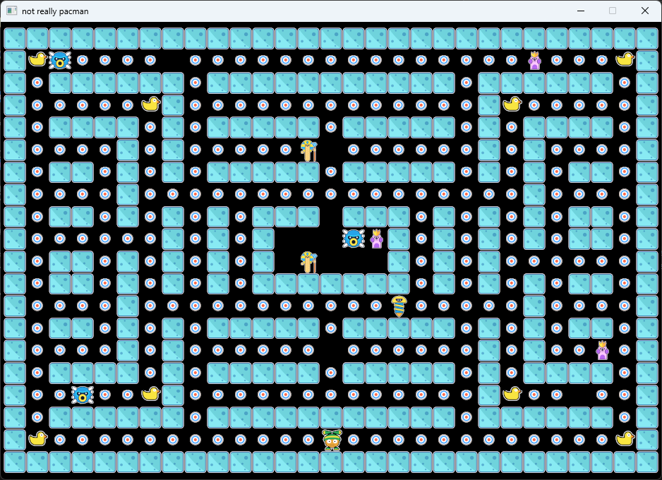

# Not Pacman



This implements a game that -- I guess -- you should already know how to play.
Obviously, any resemblance with a famous game from the 80s is purely accidental ;-)

Given the game is written in Rust, it should build easily regardless of the platform you intend to run it on.

## Building the game

In order to build the game, you need to have a rust toolchain installed on your machine. Check (this link)[https://www.rust-lang.org/learn/get-started]
to know how it should be done on your platform. Once that is done, the compilation is pretty straightforward: 

```
cargo install --release
```

That's it: the binary for your game is available in the `target/release` folder. 

**Note**
In order for the game to properly work, it needs to have access to the files from the `resources` folder (this is where the map and the artwork
required by the game are located).

## Credits
This game includes artwork by "sethbyrd.com". For more info about this work or its creator, check: "www.sethbyrd.com", 
https://opengameart.org/content/cute-characters-monsters-and-game-assets 